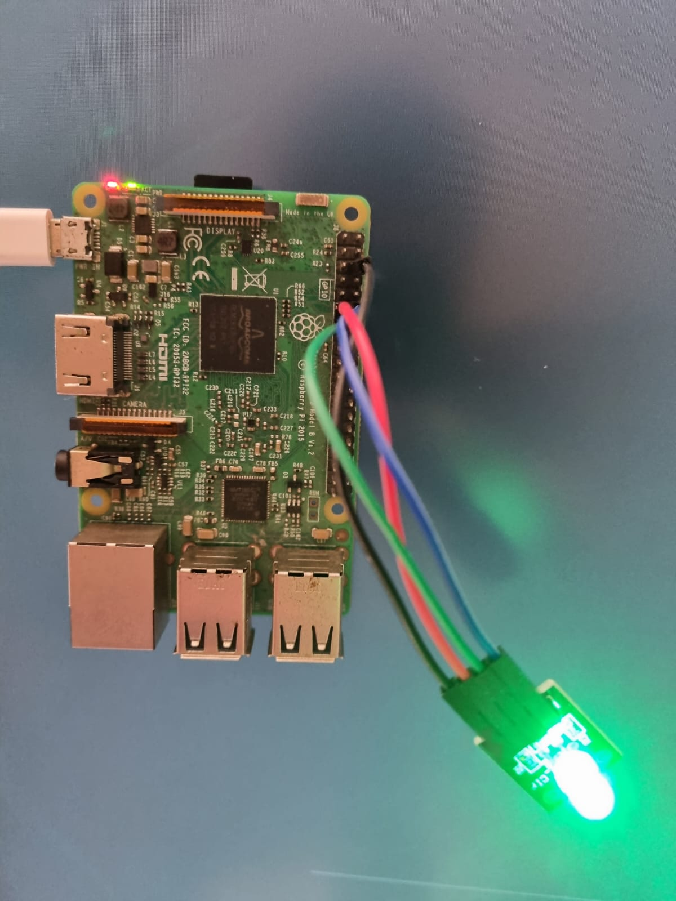

# Raspberry Pi GitHub Webhook LED Indicator

<p align="center">
    
</p>


This project is a Raspberry Pi-based GitHub webhook LED indicator. It uses LEDs to visually indicate the status of GitHub Actions workflow runs triggered by webhook events. With this setup, you can easily monitor the progress and outcome of your GitHub workflows in real-time.

## Hardware Setup

### Raspberry Pi
- Ensure you have a Raspberry Pi board (any model with GPIO pins should work). I used the 4B model
- Install the required libraries, including `RPi.GPIO`.

### LED Setup
- Connect LEDs to the GPIO pins on your Raspberry Pi. In this project, we use three LEDs:
    - Red LED (GPIO pin 17)
    - Green LED (GPIO pin 27)
    - Blue LED (GPIO pin 18)
- Configure the LEDs as output pins in your Python script.

<p align="center">
| GPIO DESC | PIN (L) | PIN (R) | GPIO DESC |
|-----------|---------|---------|-----------|
| 3V3       | 1       | 2       | 5V        |
| GPIO02    | 3       | 4       | 5V        |
| GPIO03    | 5       | 6       | Ground    |
| GPIO04    | 7       | 8       | GPIO14    |
| Ground    | 9       | 10      | GPIO15    |
| GPIO17    | 11      | 12      | GPIO18    |
| GPIO27    | 13      | 14      | Ground    |
| GPIO22    | 15      | 16      | GPIO23    |
| 3V3       | 17      | 18      | GPIO24    |
| GPIO10    | 19      | 20      | Ground    |
| GPIO09    | 21      | 22      | GPIO25    |
| GPIO11    | 23      | 24      | GPIO08    |
| Ground    | 25      | 26      | GPIO17    |
| ID_SD     | 27      | 28      | ID_SC     |
| GPIO05    | 29      | 30      | Ground    |
| GPIO06    | 31      | 32      | GPIO12    |
| GPIO13    | 33      | 34      | Ground    |
| GPIO19    | 35      | 36      | GPIO16    |
| GPIO26    | 37      | 38      | GPIO20    |
| Ground    | 39      | 40      | GPIO23    |
</p>

Raspberry Pi 4B GPIO Pinout table. The bottom of this will be where the USB ports are on the Raspberry Pi looking at the top of the board.

## GitHub Webhook Setup

1. **GitHub Repository**: Make sure you have a GitHub repository where you want to monitor workflow runs.

2. **Webhook Creation**:
   - Go to your GitHub repository.
   - Navigate to `Settings` > `Webhooks` > `Add webhook`.
   - Set the Payload URL to your ngrok public URL (e.g., `http://your-ngrok-url/webhook`).
   - Set the webhook content type to `application/json`.
   - Select the individual events or choose `Send me everything` depending on your requirements. I selected `Workflow jobs` for this project and configure my `pi-led.py` script for this.
   - Click `Add webhook`.

3. **GitHub Actions Workflow**: Ensure that your repository has GitHub Actions workflows set up that will trigger the webhook events you want to monitor. For example, you can have a workflow for building and testing your code.

## Ngrok Integration

[Ngrok](https://ngrok.com/) is used in this project to expose your local Flask server to the internet, allowing GitHub to send webhook payloads to your Raspberry Pi.

1. **Install Ngrok**: Follow the installation instructions on the Ngrok website.

2. **Expose Your Flask Server**:
   - Start your Flask server on your Raspberry Pi.
   - Run Ngrok with the following command to expose your local server:
     ```
     ngrok http 5000
     ```
   - Ngrok will generate a public URL (e.g., `http://your-ngrok-url`) that you should use as the GitHub webhook Payload URL.

## Running the Project

1. Run your Python script on your Raspberry Pi, with `python py-led.py` which listens for incoming webhook payloads and controls the LEDs based on the GitHub Actions workflow status.

2. Trigger GitHub Actions workflows in your repository, and watch as the LEDs change colors to reflect the workflow's status.

## Author

- [Jonathan Opperman](https://github.com/jcopperman)

## License

This project is licensed under the MIT License - see the [LICENSE](LICENSE) file for details.

